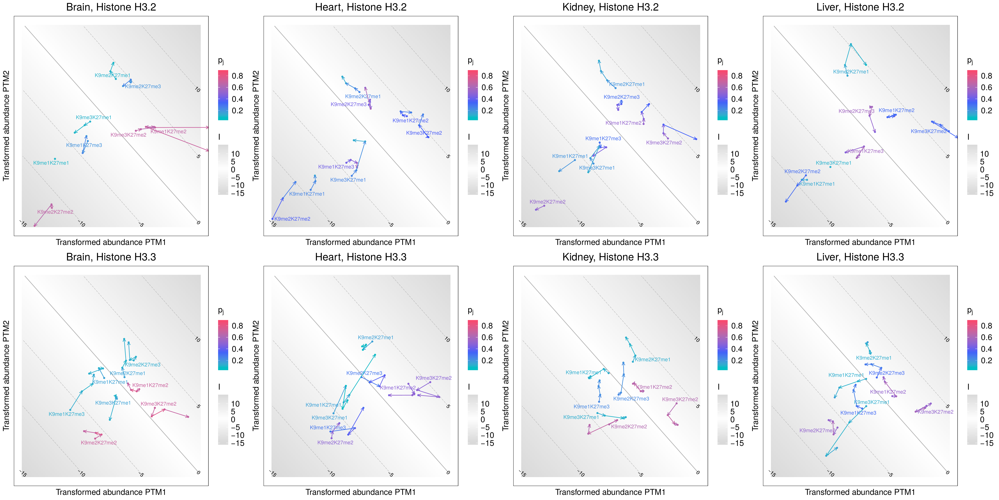

In the first example case, we would like to explore the development of histone H3 PTM abundances and crosstalk with age and compare between four mouse tissues.

Data was published in: Tvardovskiy, A., Schwämmle, V., Kempf, S. J., Rogowska-Wrzesinska, A., & Jensen, O. N. (2017). Accumulation of histone variant H3.3 with age is associated with profound changes in the histone methylation landscape. Nucleic Acids Research, 45(16), 9272-9289.

The code included in this document can be found as a coherent R scripts [here](https://github.com/veitveit/CrossTalkMapper/tree/master/doc/scripts/), and more examples [here](https://github.com/veitveit/CrossTalkMapper/blob/master/mouse-tissue-analysis/h3/scripts/crosstalkmaps_h3.R).

## R Session Setup

Set the working directory and import the PTM-CrossTalkMapper functions.

```{r, eval=FALSE}
setwd("/path/to/CrossTalkMapper/doc/")
source("../ctm-functions/ptm-crosstalkmapper.R")
```

## Data Preparation

The data file containing quantified PTM data we used here was downloaded from [CrosstalkDB](http://crosstalkdb.bmb.sdu.dk/) and prepared as described in the [README](https://github.com/veitveit/CrossTalkMapper/tree/master/data) to add the "timepoint" and "biological replicate" columns. Alternatively, a .csv file can be prepared with a [similar structure](https://github.com/veitveit/CrossTalkMapper#data).

```{r}
head(read.csv("../data/mouse-tissues_ctdb_timerep_4timepoints.csv"))
```

The first PTM-CrossTalkMapper function `prepPTMdata()` imports and prepares the proteoform data for calculating PTM abundances. Data are imported from the path given to the function as the first argument. `histvars = FALSE` lets the function ignore individual histone variants and calculates H3 total proteoform abundances. `avrepls = TRUE` (the default) averages the abundances from biological replicates after 0-imputation of missing values. Finally, CrosstalkDB columns that are not relevant for the generation of crosstalk maps are eliminated, and a data frame with the adjusted data is returned.

```{r}
data <- prepPTMdata(csv = "../data/mouse-tissues_ctdb_timerep_4timepoints.csv", histvars = FALSE, avrepls = TRUE)
head(data)
```

The cell type / tissue entries will later be used as labels in the crosstalk maps. Therefore, the long expressions in this example were shortened at this point.

```{r}
data$cell.type...tissue <- gsub(".*, ", "", data$cell.type...tissue)
data$cell.type...tissue <- paste0(toupper(substr(data$cell.type...tissue, 1, 1)),
                                  substr(data$cell.type...tissue, 2, nchar(data$cell.type...tissue)))
head(data)
```

## Calculating and Transforming PTM Abundances

`calcPTMab()` takes the data frame object generated by `prepPTMdata()` as input (first argument) and calculates and transforms individual abundances ($p_i$ and $p_j$), co-occurrences ($p_{ij}$) and interplay scores ($I$) for each observed combination of two PTMs $m_i$ and $m_j$ and transforms the individual abundances ($\hat{p}_i$ and $\hat{p}_j$). The results are returned as data frame and printed to a file called `ptm-abundances.tab` in the directory specified with `outdir =` (by default the working directory).

```{r}
ptm_ab <- calcPTMab(data, outdir = "data/h3/")
head(ptm_ab)
```

## Filtering Data and Generating PTM-Crosstalk Maps

A crosstalk map is generated by applying the function `CrossTalkMap()` to the PTM abundance data in `ptm_ab`.

Assume we would like to compare PTM abundances and crosstalk between all observed modifications (acetylation, mono-, di- and trimethylation) at the positions K9 and K27. For that purpose, all rows containing the respective positions and their PTM abundances are extracted from `ptm_ab`. For labels that are ordered according to the amino acid sequence, i.e. K9me1K27me1 instead of K27me1K9me1, grep the first position in `ptm_ab$mi` and the second position in `ptm_ab$mj`.

```{r}
ptm_ab_pos <- ptm_ab[grepl("K9", ptm_ab$mi) & grepl("K27", ptm_ab$mj),]
```

The filtered dataset is passed as the first argument to `CrossTalkMap()`. The next three options define how the experimental variables, here tissue, time point and replicate, are organized in the plot. In this example, which uses the default arguments, individual maps are generated for each of the tissues (`splitplot_by = "tissue"`), all with the same ranges for abundances and interplay score. The different instances of the variable passed to `connected =` may be connected by lines or arrows, depending on the arguments for `connect_dots =` and `with_arrows = `. Here, these groups of data points connected by arrows represent the time series of each PTM pair (`connected = "timepoint"`). The data points are grouped by the variable passed to `group_by =`, and only connected within these groups. For this particular example, this parameter is irrelevant because the measurements for the remaining experimental variable, the replicates, have been averaged, so there is only one measurement for each PTM pair for each time point and tissue. In this case, the default argument `group_by = "repl"` does not have to be modified.

`colcode =` determines according to which parameter the data points will be color-coded, in this case $p_j$, the abundance of PTMs at K27. `which_label =` can take the arguments "mj" (default) for an individual or "mimj" for the combinatorial PTM label. The interplay score contour lines can be labeled with short (default) or long labels (`contour_labels = "long"` produces `I = <value>` labels) or omitted altogether by setting `contour_lines = FALSE`.

The plot is printed to a file with the file name provided to `filename_string =` in the directory `outdir =`, relative to the working directory (default is the working directory). The file format can be specified by `filename_ext =`, where the default is "pdf" and other options are "eps", "ps", "tex" (pictex), "jpeg", "tiff", "png", "bmp", "svg" or "wmf" (additional packages might be required). If `filename_string =` is omitted from the function call, the plot object is returned directly and no file is generated.

```{r, eval=FALSE}
CrossTalkMap(ptm_ab_pos,
             splitplot_by = "tissue", connected = "timepoint", group_by = "repl",
             connect_dots = TRUE, with_arrows = TRUE, colcode = "pj", which_label = "mimj",
             contour_lines = TRUE, contour_labels = "short",
             filename_string = "K9-K27_all-ptms", filename_ext = "pdf",
             outdir = "plots/h3/crosstalkmaps/")
```

```{r, echo=FALSE}

```

The result looks pretty crowded, so let's look at methylations only in the following. The remaining PTM pairs can be compared much easier.

```{r, eval=FALSE}
ptm_ab_pos_mod <- ptm_ab_pos[grepl("me", ptm_ab_pos$mi) & grepl("me", ptm_ab_pos$mj),]
CrossTalkMap(ptm_ab_pos_mod,
             splitplot_by = "tissue", connected = "timepoint", group_by = "repl",
             connect_dots = TRUE, with_arrows = TRUE, colcode = "pj", which_label = "mimj",
             contour_lines = TRUE, contour_labels = "short",
             filename_string = "K9-K27_all-ptms_me", filename_ext = "pdf",
             outdir = "plots/h3/crosstalkmaps/")
```

```{r, echo=FALSE}

```

## Considering Histone Variants

Different histone variants, such as H3.1/2 and H3.3, often show substantially different PTM patterns. To distinguish between histone variants in the dataset used above, the `prepPTMdata()` function has a `histvars =` option, which keeps the input proteoform abundances based on histone variants if set to `TRUE`.

```{r}
histvar_data <- prepPTMdata(csv = "../data/mouse-tissues_ctdb_timerep_4timepoints.csv", histvars = TRUE, avrepls = TRUE)
histvar_data$cell.type...tissue <- gsub(".*, ", "", histvar_data$cell.type...tissue)
histvar_data$cell.type...tissue <- paste0(toupper(substr(histvar_data$cell.type...tissue, 1, 1)),
                                  substr(histvar_data$cell.type...tissue, 2, nchar(histvar_data$cell.type...tissue)))
head(histvar_data)
```

`calcPTMab()` lets us then calculate the PTM abundances in the same way as in the H3 total example above.

```{r}
histvar_ptm_ab <- calcPTMab(histvar_data, outdir = "data/histvars/")
head(histvar_ptm_ab)
```

Filtering and calling `CrossTalkMap()` in the same way as previously adds the information level of histone variants and generates two crosstalk maps for each tissue, based on the number of histone variants in the `hist` column of `histvar_ptm_ab`, which `prepPTMdata()` took care of in the first step.

```{r, eval=FALSE}
histvar_ptm_ab_pos <- histvar_ptm_ab[grepl("K9", histvar_ptm_ab$mi) & grepl("K27", histvar_ptm_ab$mj),]
histvar_ptm_ab_pos_mod <- histvar_ptm_ab_pos[grepl("me", histvar_ptm_ab_pos$mi) & grepl("me", histvar_ptm_ab_pos$mj),]
CrossTalkMap(histvar_ptm_ab_pos_mod,
             splitplot_by = "tissue", connected = "timepoint", group_by = "repl",
             connect_dots = TRUE, with_arrows = TRUE, colcode = "pj", which_label = "mimj",
             contour_lines = TRUE, contour_labels = "short",
             filename_string = "K9-K27_all-ptms_me", filename_ext = "pdf",
             outdir = "plots/histvars/crosstalkmaps/")
```

```{r, echo=FALSE}

```

```{r, echo=FALSE, eval=FALSE}
# pdf to png for knitr::include_graphics
for i in *.pdf; do pdftoppm $i ${i%.pdf} -png -singlefile -r 300; done
```

